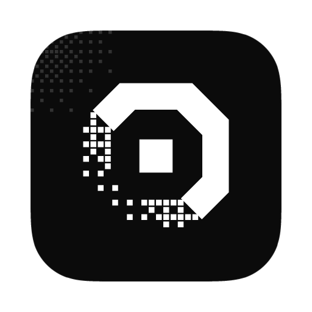

<p align="center">
  
</p>
<p align="center">
  <a href="https://lsuite.xyz/ryolune">Website</a> ·
  <a href="https://github.com/ludovic111/ryolune/releases/latest">Download</a> ·
  <a href="https://lsuite.xyz/ryolune/support">Support</a>
</p>

<h1 align="center">ryolune</h1>

<p align="center"><strong>The open-source DAW your AI can drive.</strong> (beta)<br/>
Native Rust app (GPUI) · drivable by your AI (MCP, CLI, built-in agent) · beta for Linux; macOS and Windows coming soon.<br/>
Part of <a href="https://lsuite.xyz">lsuite</a>, the free, open-source creative suite your AI can drive.</p>

---

## What it does

A complete digital audio workstation (in beta for Linux; macOS and Windows coming soon) in which every action, from
adding a track to mixing a plugin's parameters, is a command that you, the built-in agent, a
script or any MCP client (Claude Code, Codex, Cursor…) can run on the same song, with the same
undo.

Record while you hear yourself through your effects, write and edit MIDI with the full expression
of your keyboard, arrange with fades and song markers, mix on a real mixer with stock, CLAP, VST3
and Audio Unit plugins, automate anything, and export a mix or stems as WAV, AIFF, FLAC or Ogg
Vorbis. Ask the built-in agent for a bass line or a mix check in your own words: it works on the
same song, and every edit it makes is one undo away.

**Making music**

- **All Rust, window included**: the audio engine (sample-accurate automation and controllers,
  plugin delay compensation, input monitoring, count-in, crash-isolated plugin scanning) and the
  window, drawn on the GPU with GPUI. No webview, no JavaScript.
- **The lsuite look** (design system v2, shared with kimchi): black and white, square corners,
  film grain and dithered light behind the chrome, solid work surfaces, every area titled and
  its tools boxed together, in dark and light, with text contrast tested on every surface.
- **Coming from another app**: a first-run setup asks which app you made music in, connects an
  agent and checks the sound, then starts you on the demo, an empty song or your old song.
  DAWproject import and export (Bitwig Studio, Studio One, Cubase and others) carries tracks,
  sends, MIDI and audio clips, markers, tempo, automation and plugins; MIDI and stems cover the
  apps without it. File > Open Recent lists the songs you opened lately.

**With AI**

- **Conversations that stay with the song**: each song keeps its agent conversations and a
  project memory (the key, the style, what to leave alone) that every request reads. Type while
  the agent works to steer it without losing what it has done.
- **Sounds from a description**: loops that fit your bars and key, song ideas, one-shots and
  playable instruments, made with ElevenLabs, Stable Audio, fal.ai or your own endpoint and placed
  in one undo step. Any sound can become a Sample Keys instrument.

**Your files**

- **Offline and private**: no account, no telemetry. Songs are single `.ryolune`
  files with the audio inside. Logs and crash reports stay on your computer (Settings >
  Diagnostics); Help > Report a Problem opens a GitHub issue for you to read before sending.

## Install

Download the file for your computer from the
[latest release](https://github.com/ludovic111/ryolune/releases/latest) or
[lsuite.xyz/ryolune](https://lsuite.xyz/ryolune):

While lsuite is in beta, ryolune is built for **Linux** (x86_64) only. **macOS and Windows are
coming soon**: the code is there and builds from source, but no ready-made builds are published.

| Computer | File |
| --- | --- |
| Linux | `ryolune-linux-x86_64.zip` (or `.tar.gz`), or `ryolune-linux-x86_64` for the app alone |
| Mac, Windows | Coming soon |

The `.zip` (and the `.tar.gz`) holds all three executables (`ryolune`, `ryolune-cli`,
`ryolune-mcp`); extract them into one folder. The single `ryolune-linux-x86_64` file is the app
alone, without the CLI and the MCP server: put it in a folder of its own, make it executable with
`chmod +x` and run it; the first update adds `ryolune-cli` and `ryolune-mcp` beside it.
The demo song is `ryolune-Afterglow-demo.zip` on the same page.

Or install it with the [lsuite launcher](https://lsuite.xyz/launcher).

ryolune checks for updates when it starts and every six hours while it stays open (Help > Check
for Updates…). An update is installed only after its Ed25519 signature, download host, checksum
and binary versions are verified; the previous copy is kept until the new one starts, and
**Restart now** starts it. The first time a new version opens, What's New lists what changed
since the one you had. `RYOLUNE_NO_UPDATE=1` turns the check off.

### Start

The first time it opens, ryolune's setup offers the demo song, an empty song or a song from your
old app (Help > Set Up ryolune… shows it again). Then:

1. File > New Session: Drums, Bass and an audio track are ready.
2. Double-click a loop in the browser, or draw a region with the Pencil tool (`2`) and click in
   the piano roll to add notes. Space plays.
3. Mix in the inspector or the mixer (`X`), save with `Ctrl+S`, export with `Ctrl+B`.

Or open File > Open Demo to explore a finished song, or File > Import from Another App… to bring
in a DAWproject, a MIDI file or stems. The [user guide](docs/USER_GUIDE.md) walks through
everything.

## Drive it from AI and scripts

Everything a person can do in the window is a command that the built-in agent, `ryolune-cli` and
any MCP client can call, with a one-call overview of the whole song and full access to external
plugins' parameters and state. The window, the built-in agent, `ryolune-cli` and `ryolune-mcp`
all run the same [command registry](docs/COMMANDS.md), with the same undo history. While the app
runs, clients connect over a local, token-protected bridge; without it they edit a song file
directly.

Add ryolune to Claude Code or any MCP client:

```sh
claude mcp add ryolune -- /path/to/ryolune/ryolune-mcp --live
```

Settings shows a ready setup for Claude Code, Codex, Cursor, VS Code, Claude Desktop, Gemini CLI
and other MCP apps.

```sh
ryolune-cli session.overview                    # the whole song in one call
ryolune-cli track.add --kind midi --name Keys --instrument "E-Piano Mk I"
ryolune-cli clip.create --trackId Keys --startBar 0 --lengthBars 2 \
    --notes '[{"start":0,"length":2,"pitch":60},{"start":2,"length":2,"pitch":64}]'
ryolune-cli plugin.list --query reverb
ryolune-cli history.undo
ryolune-cli --file song.ryolune session.exportAudio --path mix.flac
```

The built-in agent runs on the agent you bring: Codex or Claude Code with their own sign-in, an
API key (Anthropic, OpenAI, Gemini, OpenRouter, Mistral, Groq, DeepSeek, xAI), or a model on your
computer (Ollama, LM Studio or any compatible server). Everything in ryolune is free, with no
lsuite account.

See [AI_CONTROL.md](docs/AI_CONTROL.md) for the agent, the CLI, MCP, permissions and recipes.

## Plugins

- **35 stock instruments and effects** with front panels that draw what the audio does, plus
  your own CLAP, VST3, Audio Unit (macOS, coming soon) and lsuite plugins, all in one Plugins window with a
  switch on each.
- **Plugins you can ask for**: describe an effect or an instrument and your agent writes it in
  Rust on ryolune's SDK, builds it and loads it, without a restart (`plugin.guide`,
  `plugin.new`, `plugin.build`, `plugin.publishLocal`).

Hosting is described in [PLUGINS.md](docs/PLUGINS.md), writing plugins in Rust in
[NATIVE_PLUGINS.md](docs/NATIVE_PLUGINS.md).

## Works with the rest of lsuite

Send a mix or stems onto a kimchi video project, score a cut that comes back from kimchi, and
find the other apps through `~/.lsuite`.

## Documentation

Every document is listed in [docs/README.md](docs/README.md).

| Document | What it covers |
| --- | --- |
| [User guide](docs/USER_GUIDE.md) | The window, tracks, recording, editing, mixing, automation, files, appearance, settings |
| [Keyboard shortcuts](docs/SHORTCUTS.md) | Every shortcut (generated from the app) |
| [AI control](docs/AI_CONTROL.md) | The built-in agent, `ryolune-cli`, `ryolune-mcp`, permissions, recipes |
| [Command reference](docs/COMMANDS.md) | Every command and parameter (generated from the registry) |
| [The agent panel](docs/AGENT.md) | Providers, outside agents, the conversation, Generate, Changes and Takes |
| [Plugins](docs/PLUGINS.md) | CLAP, VST3 and Audio Unit hosting |
| [Native plugins](docs/NATIVE_PLUGINS.md) | Writing plugins in Rust with the ryolune SDK |
| [Configuration](docs/CONFIGURATION.md) | Every setting, the data folder, environment variables and flags |
| [Session format](docs/SESSION_FORMAT.md) | The `.ryolune` file, field by field |
| [Architecture](docs/ARCHITECTURE.md) | How the crates, registry, audio engine, plugin hosts and window fit together |
| [Development](docs/DEVELOPMENT.md) | Code layout, building, checks, releases |
| [Release notes](docs/releases/) | What changed in each version |
| [Verification](docs/VERIFICATION.md) | What has been tested and how |

## Architecture

One Cargo workspace; every crate shares one version. Details in
[ARCHITECTURE.md](docs/ARCHITECTURE.md).

| Crate | Folder | What it is |
| --- | --- | --- |
| `ryolune` | `desktop/` | The app: the host that owns the document and audio, and the GPUI window, the built-in agent, updates. The default member. |
| `ryolune-engine` | `engine/` | Everything without a window: session model, store and undo, the command registry, DSP and rendering, devices, plugin hosting (VST3, CLAP, AU, native), documents, export, settings. |
| `ryolune-tools` | `tools/` | `ryolune-cli` and `ryolune-mcp`, thin clients of the registry. |
| `ryolune-plugin` | `sdk/` | The native plugin SDK: the `Plugin` trait, DSP helpers and the frozen C ABI. |
| `ryolune-plugin-gain` | `plugins/gain/` | Example native plugin bundle (Trim and Tilt EQ), used by tests. |
| `ryolune-plugin-bitcrusher` | `plugins/bitcrusher/` | Example plugin written on the SDK: Bitcrusher. |
| `ryolune-plugin-chorus` | `plugins/chorus/` | Example plugin written on the SDK: Chorus. |
| `ondera-abi1-fixture` | `plugins/abi1-fixture/` | A plugin frozen at ABI 1, so tests prove old libraries still load. Its name is kept on purpose. |

## Development

```sh
cargo run --release
```

Rust 1.88+ is all it needs: the window is Rust too, drawn on the GPU with GPUI. On Ubuntu/Debian,
install the system libraries first:

```sh
sudo apt-get install build-essential pkg-config libasound2-dev libudev-dev \
  libxkbcommon-dev libxkbcommon-x11-dev libwayland-dev libx11-dev libx11-xcb-dev \
  libxcb1-dev libfontconfig1-dev libfreetype6-dev libvulkan-dev libdbus-1-dev \
  libssl-dev libzstd-dev
```

Check with `cargo fmt --all --check`, `cargo clippy --workspace --all-targets --locked -- -D warnings`
and `cargo test --workspace --locked`. A release is a version bump in `Cargo.toml`, notes in
`docs/releases/X.Y.Z.md` and a `vX.Y.Z` tag; the Release workflow builds and signs the Linux build
(macOS and Windows are not built during the beta; `bash scripts/package-macos.sh` still bundles
`dist/ryolune.app` from source). Platform
prerequisites, checks and the release process are in [DEVELOPMENT.md](docs/DEVELOPMENT.md).

Issues and pull requests are welcome. Read [CONTRIBUTING.md](CONTRIBUTING.md) first: pull requests
need the checks in [DEVELOPMENT.md](docs/DEVELOPMENT.md) and agreement to the
[Contributor License Agreement](CLA.md).

## Limits

No time stretching, comping or time signature changes inside a song yet, and buses do not feed
other buses. Recording latency is not compensated automatically. On Linux, external plugins show their parameter list
(their own windows open on macOS, coming soon). VST2 and AAX are not supported. There is no MP3
export. DAWproject does not carry clip gain, fade curves,
plugin automation or meter changes, and Ableton Live, Logic Pro, FL Studio, REAPER, Pro Tools
and GarageBand exchange songs through MIDI and stems, not their own project files.

## License

MIT. Copyright Ludovic Marie. See [LICENSE](LICENSE).

The bundled fonts, Chakra Petch and IBM Plex Mono, are under the SIL Open Font License 1.1
(`desktop/assets/fonts`). A few interface icons come from Lucide (ISC,
`desktop/assets/icons/LICENSE.lucide.txt`) and the AI provider marks from Lobe Icons (MIT,
`desktop/assets/providers`). Logos of plugin formats and music apps are trademarks of their
owners, used only to name them; sources and terms are in `desktop/assets/logos/NOTICE.md`.

ryolune is open source and free forever: every feature and every update, for everyone. If it
earns a place in your music, you can [donate](https://lsuite.xyz/ryolune/support), once or monthly.
Donations are optional, unlock nothing, and are the only money ryolune takes; they keep it built
full time.
